# Genolink User Guide

Genolink connects passport information for plant accessions with their available genotype data. Passport records are sourced from [Genesys PGR](https://www.genesys-pgr.org/), while genotype data can be discovered and queried from supported genomic platforms such as Gigwa and Germinate.

This guide is written for first-time users and follows the normal workflow from finding accessions to exporting genotype data.

## 1. Getting started

The application has two main tabs:

- **Passport Data** is used to find accessions, review passport metadata, and select accessions for genotype analysis.
- **Genotype Data** is used to locate datasets containing the selected accessions, filter variants, inspect genotypes, and export VCF data.

The top of the page also contains two useful controls:

- **View** opens a window for choosing which passport metadata columns are displayed.
- **Help** opens this user guide in a new browser tab.

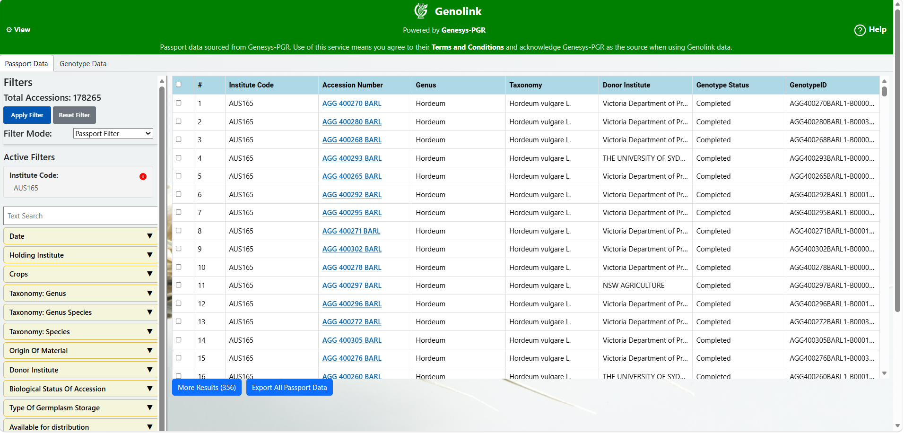

Passport data is supplied by Genesys PGR. Follow the Genesys terms and conditions and acknowledge Genesys when using data obtained through Genolink.

## 2. Finding passport data

Open the **Passport Data** tab and choose a **Filter Mode**. Genolink offers three ways to search.

### 2.1 Passport Filter

Use **Passport Filter** to build a structured search. Available filters include:

- free-text search;
- creation and acquisition date ranges;
- holding institute;
- crop;
- genus, genus and species, or species;
- origin of material;
- donor institute;
- biological status of the accession;
- type of germplasm storage;
- availability for distribution;
- curation type;
- FIGS set; and
- Genesys subset.

Open a filter section, select one or more values, and then choose **Apply Filter**. Compatible filters are combined to narrow the results.

The free-text search is an alternative broad search. While text is present in that box, **Check for genotype** is unavailable.

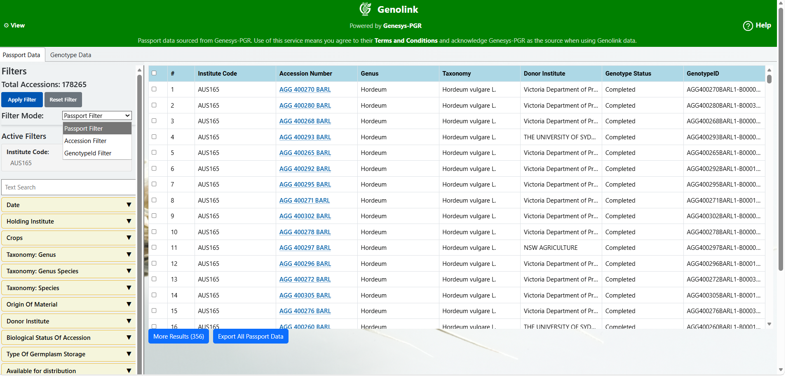

### 2.2 Accession Filter

Use **Accession Filter** when accession numbers are already known. Enter values separated by commas, or upload a `.txt` file. Uploaded values may be separated by commas, new lines, tabs, semicolons, or vertical bars.

After entering the accessions, choose **Apply Filter**.

### 2.3 GenotypeId Filter

Use **GenotypeId Filter** when genotype or sample IDs are known. Enter IDs separated by commas, or upload a `.txt` file using the same supported separators as the Accession Filter.

Genolink maps the supplied genotype IDs to accessions and retrieves their passport records. Depending on the deployment configuration, mappings may come from the Genolink database, Genesys, or a combination of both sources.

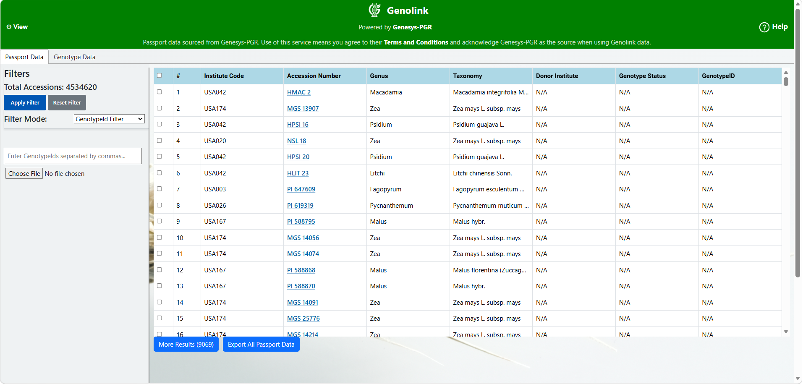

### 2.4 Check for genotype

In Passport Filter mode, enable **Check for genotype** to restrict the result to accessions that have genotype mappings. This is useful when the next step will be genotype exploration.

### 2.5 Active filters and reset

Applied criteria appear under **Active Filters**. Select the red remove icon beside an individual filter to remove it, or choose **Reset Filter** to clear the current search and restore the default filter state.

The **Total Accessions** value reports how many records match the current search. The table initially loads a portion of those records; additional pages can be loaded later.

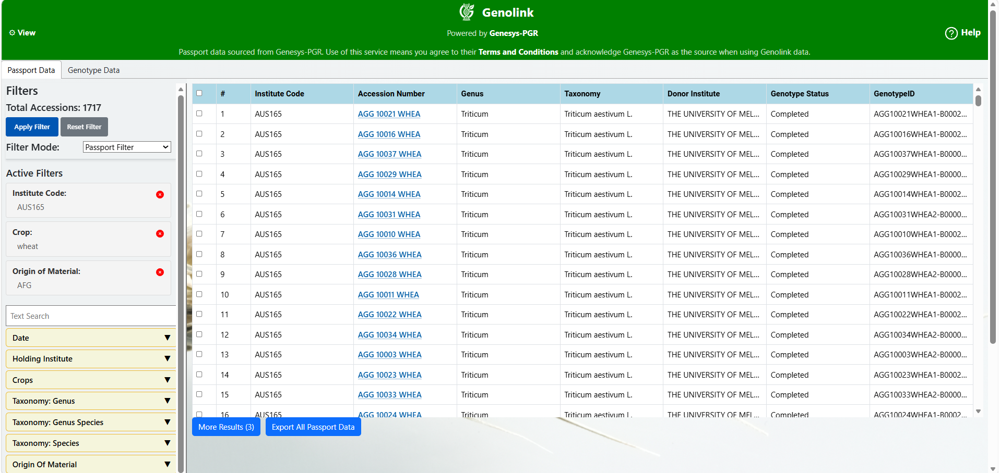

## 3. Controlling the passport table view

Choose **View** at the top of the page to open **Select Metadata Columns to display**.

The window allows you to:

- select or clear individual metadata fields;
- use **Select all** to restore all available columns;
- use **Clear** to clear the draft selection;
- choose **Cancel** to discard changes; or
- choose **Save & Refresh** to save the selection and refresh the passport results.

If no columns are selected when the view is saved, Genolink restores the default set of all columns. The saved choice is retained in the browser for future visits.

Available columns include passport descriptors such as institute, accession, taxonomy, crop, provenance, dates and DOI, as well as Genolink-enriched fields such as genotype status, Genotype ID, dataset DOI etc.

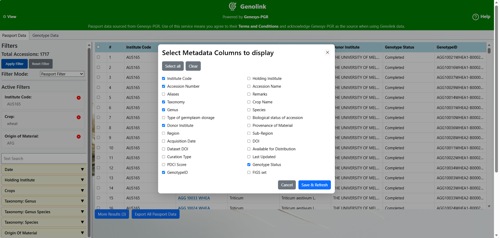

Changing the table view does not control which fields are exported. Export fields are selected separately when starting a passport export.

## 4. Working with passport results

Each row represents one accession.

- Select a row's checkbox to include that accession in genotype exploration.
- Use the checkbox in the table header to select or clear all currently loaded rows.
- Select a row outside its checkbox to expand or collapse long cell values.
- Drag the right edge of a column heading to resize that column.
- Follow linked accession or DOI values to open their source pages when links are available.
- Choose **More Results** to append the next page of passport records. The number in parentheses shows how many pages remain.

Selections are carried to the **Genotype Data** tab. If genotype analysis is the goal, select the required accessions before changing tabs.

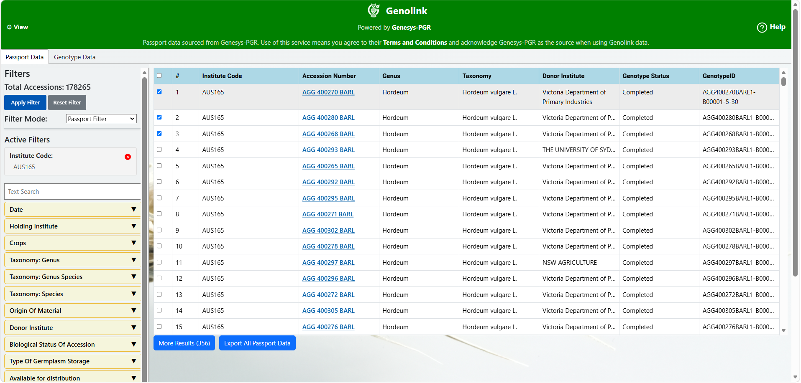

### 4.1 Genotype-related columns

The passport table may show additional information maintained or resolved by Genolink:

- **Genotype Status** describes the state of the local accession-to-sample mapping. Supported values are `Completed`, `Pending`, `Excluded`, and `TBC`.
- **GenotypeID** lists mapped sample IDs.
- **Dataset DOI** lists known genotype dataset metadata for applicable accessions.
- **Region**
- **Sub-Region**

Only completed local mappings are used when Genolink maps an accession to genotype IDs for genotype searches.

## 5. Exporting passport data

Choose **Export All Passport Data** below the passport table. The **Select Fields to Export** window opens before the download starts.

In this window:

1. Select each field that should appear in the TSV file, or enable **Select All Fields**.
2. Choose **Download** to export all records matching the current filters.
3. Choose **Close** to cancel.

**Accession Number** is always included. Country information needed by the export is handled automatically. The export selection is independent of the columns currently visible in the passport table.

The download covers the complete filtered result, not only the rows currently loaded or selected on screen. Large exports can take time; a loading indicator replaces the export button while Genolink fetches and prepares the data.

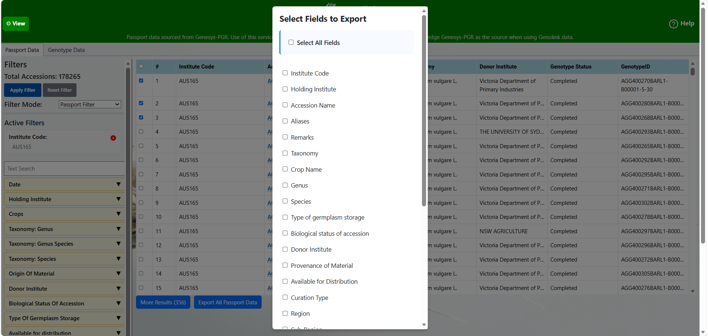

The downloaded file is named `filtered_data_selected_fields.tsv`.

## 6. Finding genotype data

Before opening the **Genotype Data** tab, search the passport data and select one or more accessions using the row checkboxes.

Genolink uses the selected accessions and their genotype mappings to identify the configured genomic platform and relevant servers. The exact platform choices and whether credentials are required depend on the deployment configuration.

### 6.1 Discover Gigwa data

For Gigwa, Genolink determines which configured server or servers are associated with the selected accessions.

When access controls are enabled, choose the appropriate mode for each server:

- **Public** accesses data that does not require a user account.
- **Private** requires a username and password for that server.

Credentials are entered separately for every private server. Then choose **Lookup Data**.

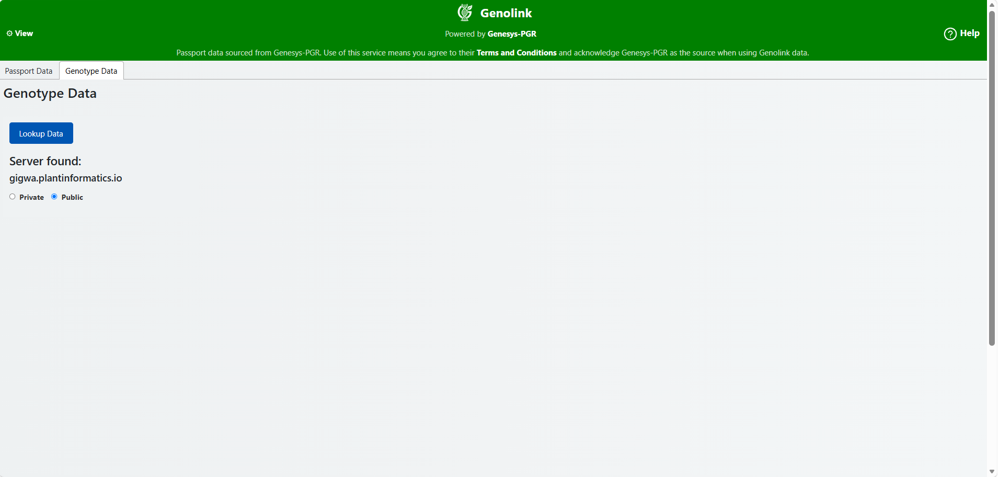

### 6.3 Review the search summary

After a successful lookup, Genolink displays a summary for each server:

- how many selected Genesys accessions have sample-name mappings; and
- how many selected accessions have genotypes present in Gigwa.

Choose **Copy Sample-Names** to copy the discovered sample names to the clipboard.

When available, a source table can also show accession, DOI, Genotype ID, and the studies containing each sample. Study headings link to the corresponding Gigwa project.

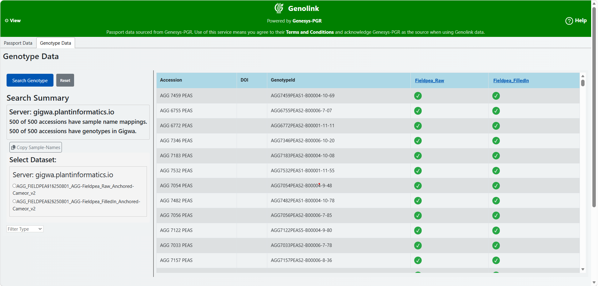

### 6.4 Select datasets

Select one dataset for each listed Gigwa server. A dataset must be selected for every server that will participate in the search.

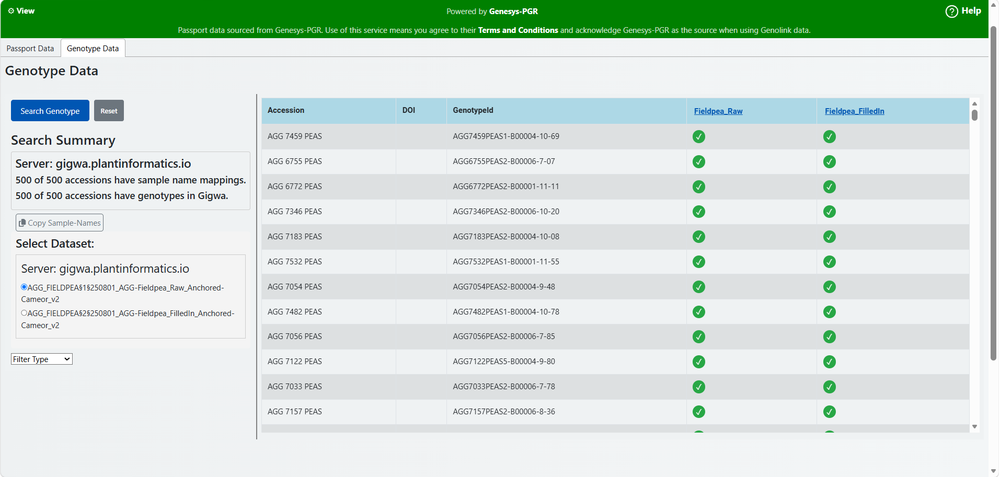

## 7. Filtering and searching genotype data

After selecting datasets, choose one of the available filter types.

### 7.1 PositionRange

Choose **PositionRange** to search a genomic interval:

1. Enter the start position.
2. Enter the end position.
3. Select a chromosome.
4. Choose **Search Genotype**.

The position values apply to the selected chromosome and datasets.

### 7.2 VariantIDs

Choose **VariantIDs** when the identifiers of the required variants are known. Enter one or more variant IDs separated by commas, then choose **Search Genotype**.

Only one of the position-range and variant-ID filters is active at a time. Switching filter type clears values belonging to the other type.

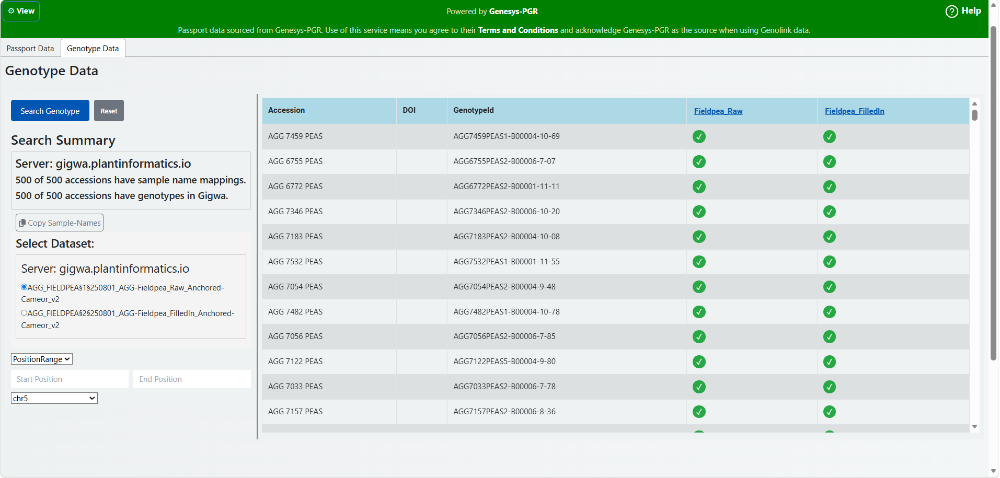

Choose **Reset** to clear the genotype workflow and start again.

## 8. Reading genotype results

Gigwa results from the participating servers are displayed in a combined table. The fixed columns identify the variant:

- `CHROM`: chromosome or reference name;
- `POS`: genomic position;
- `ID`: variant identifier;
- `REF`: reference allele; and
- `ALT`: alternate allele.

The remaining columns contain genotype values for the discovered samples. Select a variant column heading to sort the current results in ascending or descending order where sorting is enabled.

Use **First**, **Prev**, the page-number buttons, **Next**, and **Last** to move through result pages.

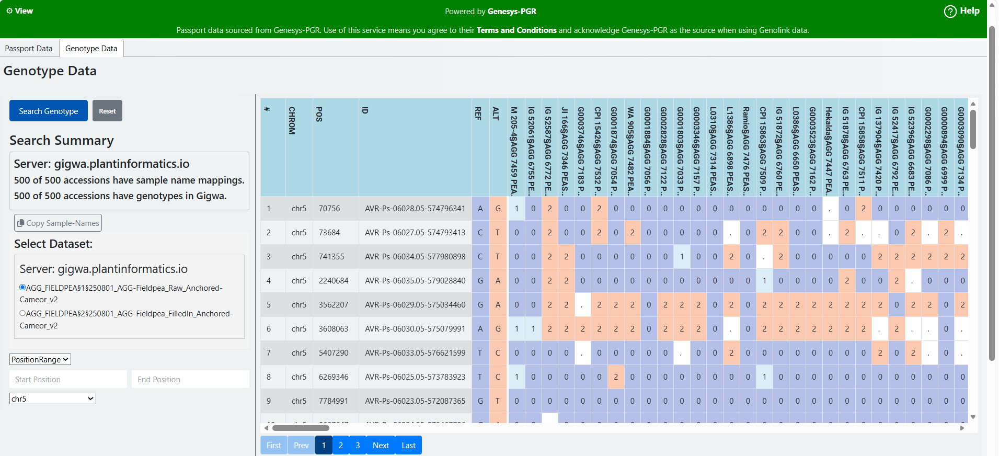

## 9. Exporting genotype data

After a Gigwa genotype search returns results:

1. Select a server from the export list.
2. Choose **Export VCF**.

VCF export is performed for one server at a time because each server may contain a different dataset or set of samples. Repeat the export for another server when required. The export uses the selected dataset, samples, and active variant or position filter.

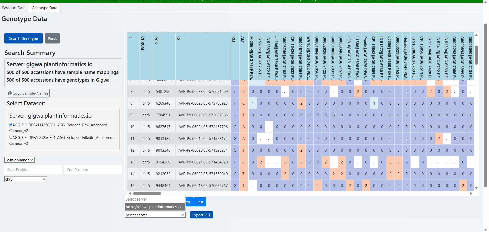

## 10. Typical end-to-end workflow

For a first genotype search, follow this sequence:

1. Open **Passport Data**.
2. Select a filter mode and enter the search criteria.
3. Choose **Apply Filter**.
4. Review the results and select the required accession rows.
5. Open **Genotype Data**.
6. Choose the genomic platform if a choice is available.
7. Select public or private access and enter credentials where required.
8. Choose **Lookup Data**.
9. Review the mapping summary and select one dataset for each server.
10. Choose **PositionRange** or **VariantIDs** and enter the filter values.
11. Choose **Search Genotype**.
12. Review the genotype table or select a server and choose **Export VCF**.

## 11. Troubleshooting

- **No passport records appear:** remove restrictive active filters, check identifiers for typing errors, or choose **Reset Filter** and try again.
- **The genotype tab finds no server:** confirm that accessions were selected in the passport table and that those accessions have completed genotype mappings with server information.
- **An accession has no genotype data:** a passport record can exist without a completed sample mapping or without the sample being present in the selected genomic platform.
- **Private Gigwa login fails:** verify the username and password for the specific server. Credentials for one server do not automatically apply to another.
- **A dataset cannot be searched:** make sure one dataset is selected for every participating server.
- **A position search returns no variants:** verify the chromosome, coordinate range, and selected dataset.
- **An export takes time:** passport exports retrieve the complete filtered result, and VCF exports may require the genomic server to prepare the file. Keep the page open while the loading indicator is displayed.
- **The application reports a Genesys error:** check the network connection and use the displayed refresh option to try loading the source data again.
