# Genolink Workflow

## 1. Filtering Mechanism for Passport Data

Genolink provides users with three primary filtering options:

- **Passport Data Filter:** Allows users to refine their search based on various passport descriptors, including:  
  - Date of collection  
  - Holding institute  
  - Crop type  
  - Taxonomic classification  
  - Geographical origin  
  - Biological status of the accession  
  - Type of germplasm storage  

  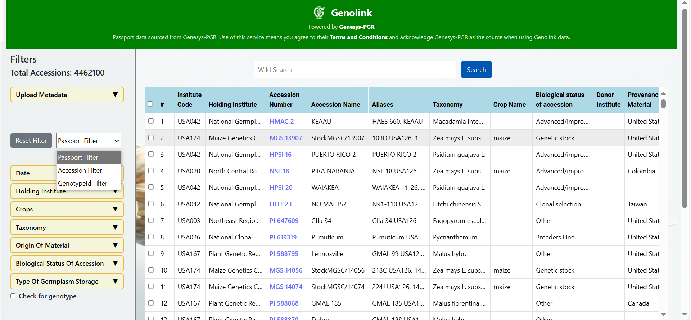
   
  <em>Figure 1: Passport Data Filter</em>

- **Accession-Based Filter:** Users can input specific accession numbers in a text box, enabling direct retrieval of associated passport records.

  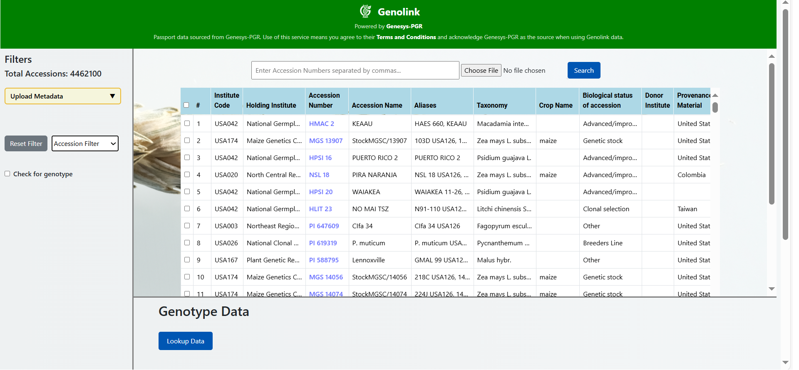
   
  <em>Figure 2: Accession-Based Filter</em>

- **GenotypeId-Based Filter:** Users can input specific genotype IDs in a text box, enabling direct retrieval of associated passport records.
  

  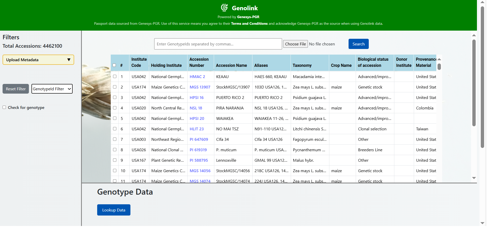
   
  <em>Figure 3: GenotypeId-Based Filter</em>

By leveraging Genesys APIs, Genolink ensures accurate and up-to-date passport data retrieval while also incorporating an option to filter accessions based on the availability of genotypic data. Each record displays its genotype status, offering an integrated view of the dataset.

  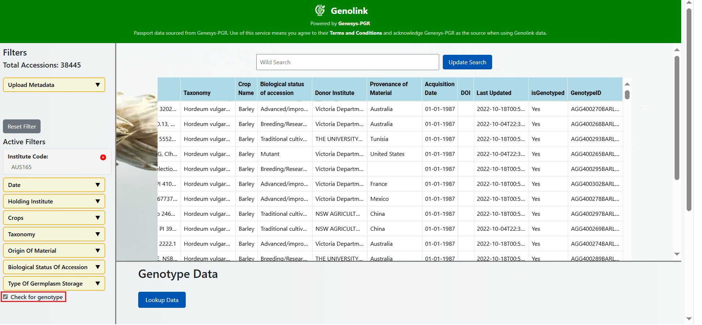
   
  <em>Figure 4: Filtering Accessions by Genotype Availability</em>

---

## 2. Linking Accessions to Genotypic Data

The genotype data associated with plant accessions is stored in Variant Call Format (VCF) files, which contain Genotype IDs as unique identifiers. To facilitate accession-genotype mapping, Genolink maintains a dedicated database table linking accessions to their corresponding Genotype IDs.

Users are required to upload a pre-formatted CSV template provided by Genolink to populate this mapping database. This step is crucial, as incomplete or incorrect mapping files will cause errors when querying genotype data. The tool ensures that only accessions with correctly linked Genotype IDs can be searched across different genomic platforms.

  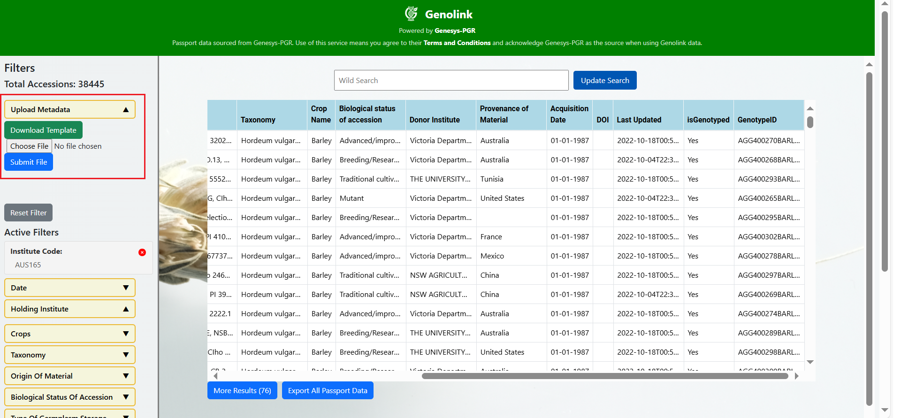
   
  <em>Figure 5: Accession-Genotype Mapping Ensures Accurate Data Linkage</em>

---

## 3. Searching for Genotypic Data

Once users apply the desired filters and obtain relevant passport data, they can proceed to search for associated genotype data within genomic databases such as Germinate and Gigwa.

Upon selecting a preferred genomic platform, Genolink cross-references the Genotype IDs and retrieves the available genotype data. If multiple datasets contain the required information, the tool presents a list of datasets, allowing users to select the most appropriate one for their analysis.

  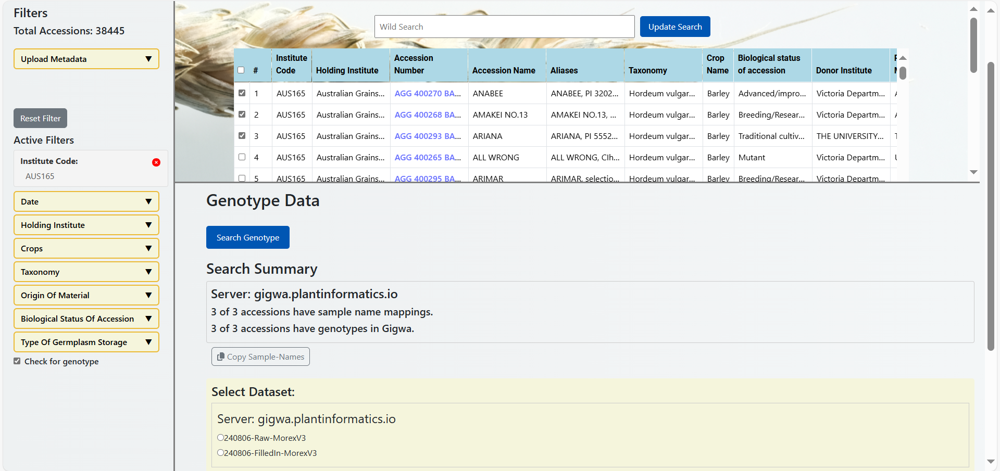
   
  <em>Figure 6: Genolink Enables Seamless Genotype Data Retrieval</em>

To refine their genotype data search, users can further filter results based on:  
- Specific chromosomes  
- Genomic positions  
- Variant IDs corresponding to particular genomic regions  

  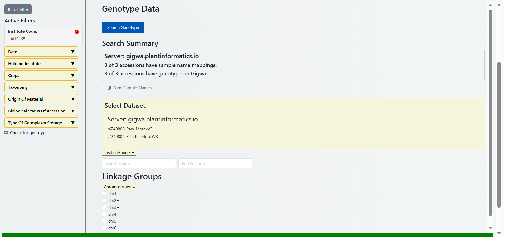
   
  <em>Figure 7: Filtering Genotype Data by Chromosome and Position</em>

  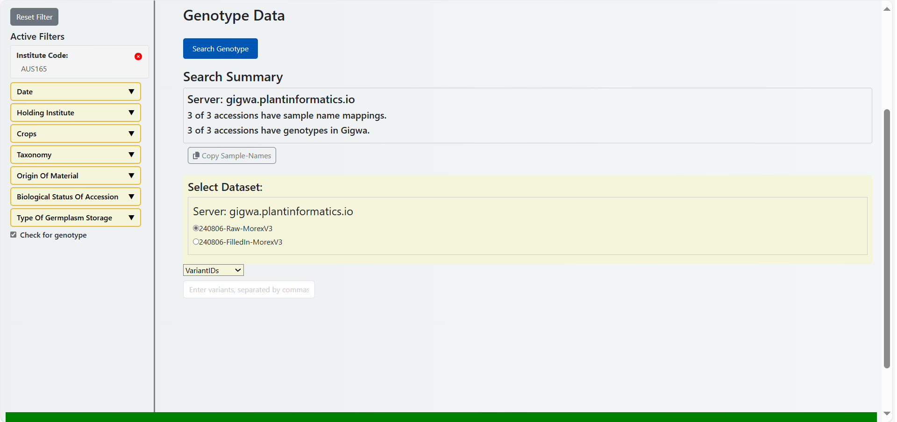
   
  <em>Figure 8: Filtering Genotype Data by Variant ID</em>

---

## 4. Data Export and Integration with External Platforms

Genolink provides users with the ability to export both passport and genotype data. Passport data can be exported in TSV format for further analysis, while genotype data can be downloaded as VCF files, preserving their original structure.

  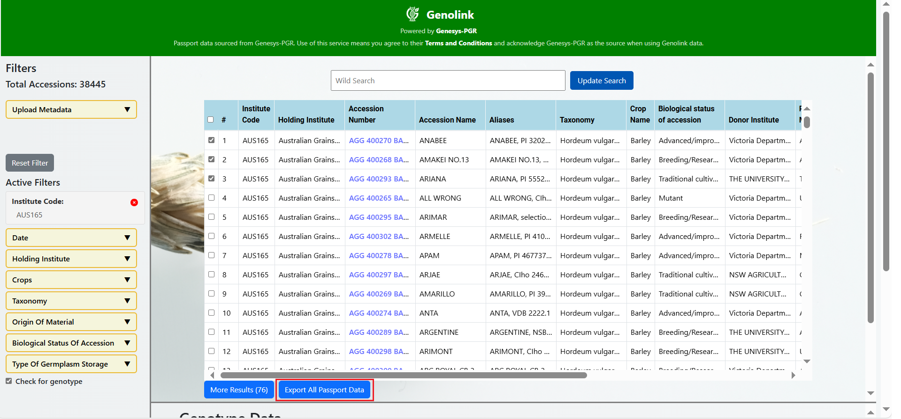
   
  <em>Figure 9: Exporting Passport Data in TSV Format</em>

  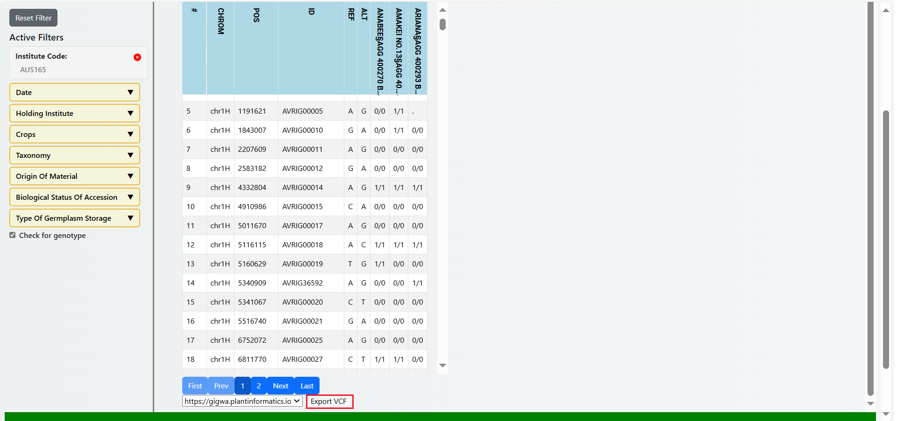
   
  <em>Figure 10: Exporting Genotype Data in VCF Format</em>

Additionally, Genolink features Breeding API (BrAPI)-compliant endpoints to facilitate integration with third-party applications. The most critical endpoints include:  
- Querying genotype data for a specific genomic position on a designated chromosome  

Furthermore, Genolink includes internal (non-BrAPI) endpoints, such as:  
- Retrieval of passport data for a given list of Genotype IDs or accession names  

These functionalities enable interoperability with external genomic databases and bioinformatics pipelines, enhancing the tool’s applicability in large-scale plant breeding and genomic studies.

---

## 5. Multiple Gigwa Servers Support

In some cases, selected accessions from the passport table belong to more than one Gigwa server. In these cases, Genolink identifies these servers and lists them for users. After providing credentials to log into these servers, users can see the search summary plus datasets on each server that include selected accessions or samples.

  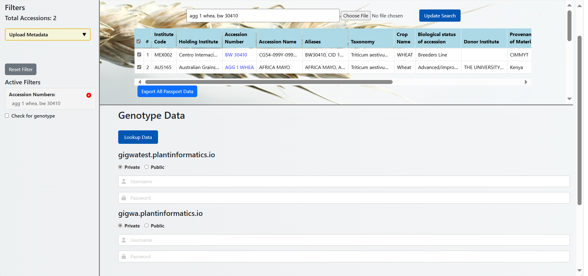
   
  <em>Figure 11: Providing credentials for each server</em>

  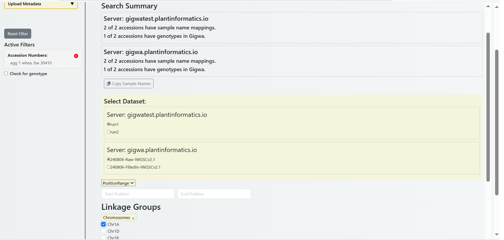
   
  <em>Figure 12: Selecting datasets and Genotype filters</em>

After selecting datasets and specifying regions, users can search for genotype data and export genotype data from each server by selecting the target server. In Genolink, genotype data from multiple servers is displayed together in the same table.

  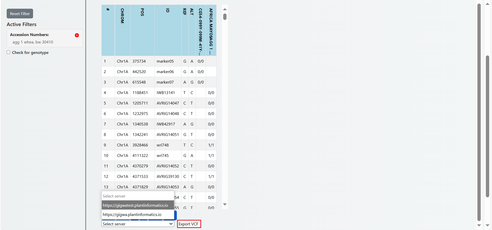
   
  <em>Figure 13: Exporting Genotype data for the selected Gigwa server</em>

